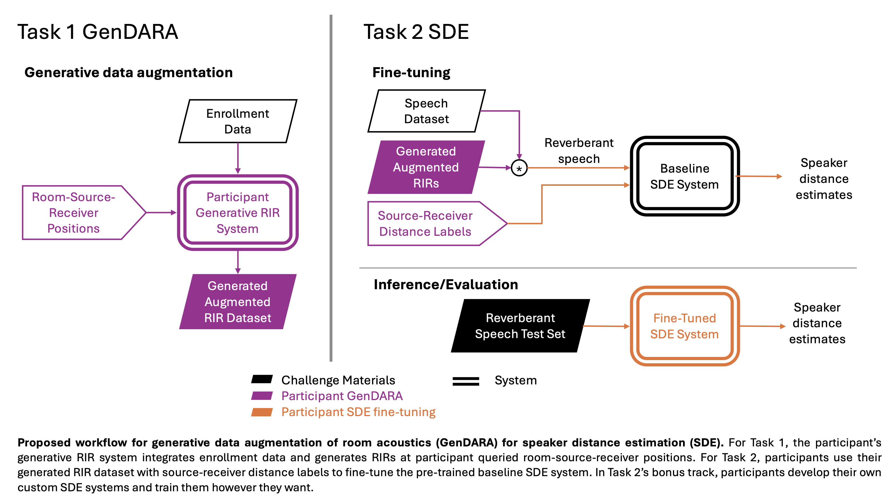
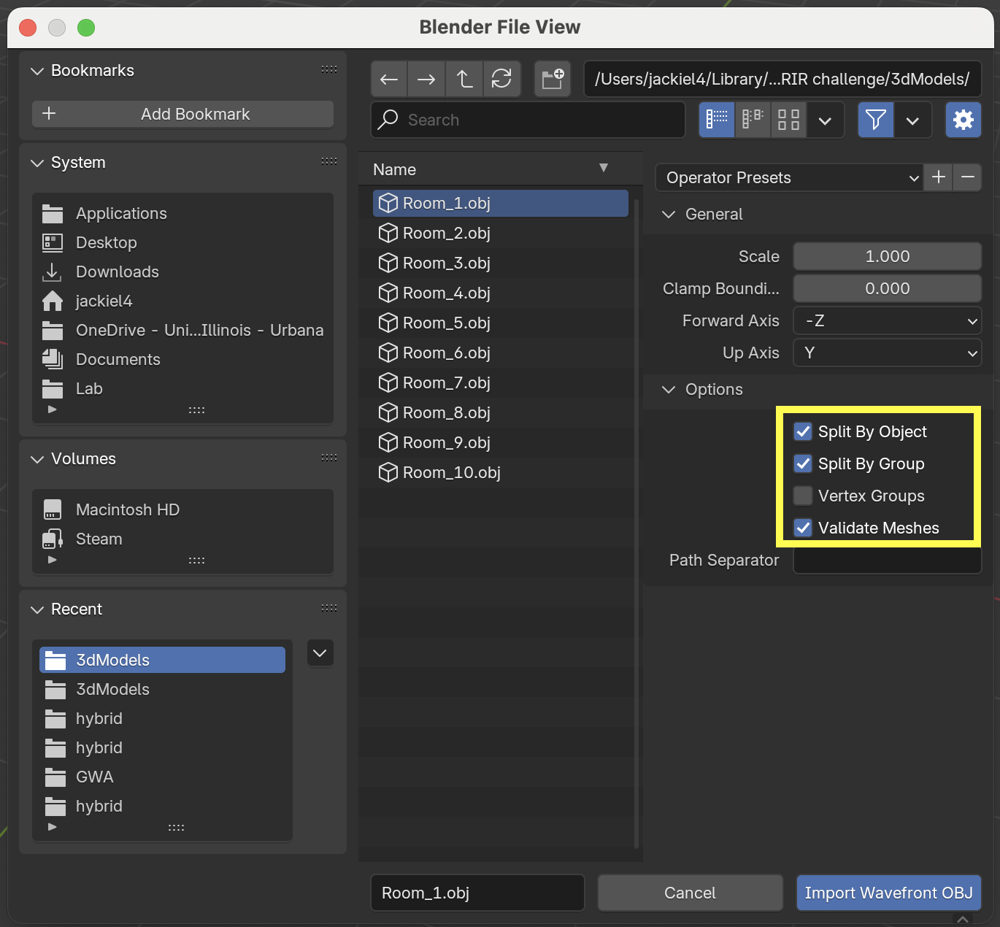

# GenDARA 2025 Challenge - Generative Data Augmentation for Room Acoustics for Speaker Distance Estimation

# Introduction

This challenge calls for RIR generation systems to augment RIR data for the downstream task, speaker distance estimation (SDE), as part of the [Generative Data Augmentation workshop at ICASSP 2025](https://sites.google.com/view/genda2025). In this challenge, participants are tasked first with building RIR generation systems to augment sparse RIR data: a handful of RIRs with labeled source-receiver positions are provided to participants, and their RIR generation system should be able to generate RIRs at new source-receiver positions to supplement the initial handful of RIRs. Subsequently, SDE systems to be trained with this augmented RIR dataset. Through this challenge, we aim to investigate how the quality of augmented data generated by RIR generation systems affects SDE model performance.

Challenge tasks:

- Task 1: Augmenting RIR Data with RIR Generation System
- Task 2: Improving Speaker Distance Estimation Model with Augmented RIR Data

We provide baseline experiments using an open-source SDE model to encourage participation and benchmark advancements.

Participation is open to all. Participants are asked to participate in both tasks rather than choosing one of the two tasks since our challenge aims to evaluate the effectiveness of generated RIRs for the downstream SDE problem.


_Figure 1: Overview of the GenDARA 2025 Challenge tasks and workflow._
  
# Challenge Details and Rules

## Task 1: Augmenting RIR Data with RIR Generation System

In Task 1, we aim to evaluate the participant's RIR generation system based on the RIRs it generates, although the main point of the challenge is to investigate its usefulness for the downstream task. At any rate, the goal of the RIR generation system is to generate RIRs from new source and receiver locations from a given set of RIRs collected within a room. The goal is to augment sparsely collected RIR data, whose quantity tends to be limited, and then use the augmented dataset to help improve the performance of downstream tasks such as speaker distance estimation, dereverberation, etc.

- To evaluate the RIR generation system performance, participants are to generate the RIRs at specified source-receiver locations in 20 rooms.
- We are most interested in generating RIRs from a few (5) RIRs are captured per room, which mimics a real-world user scenario. Thus we encourage participants to only use the subset of single-channel RIRs in the provided enrollment data.
- However, we recognize there exists many scenarios where RIRs are synthesized from other types of real-world enrollment data, for example: 3D scan of the room, images, higher order Ambisonics RIR (HOA-RIR), binaural RIRs, etc.
- To encourage participation from participants who work on RIR generation systems that take these modalities as input, we also provide and allow the use of 3D models and HOA-RIRs from half of the rooms as additional enrollment data.
- We will categorize submissions based on the subset of enrollment data used in the participant's RIR generation system.

### Enrollment Data Description

We provide data on 20 different rooms in `enrollment_data`. Rooms 1-10 are simulated using Treble Technologies' wave-based simulator. Rooms 11-20 are sampled from the GWA Dataset [1], which are simulated from a hybrid wave-based and geometrical acoustics simulator.

For Rooms 1-10, for each room we provide:

- 5 single-channel RIRs
- 5 8th-order HOA RIRs
- labeled source + receiver positions in `meta.csv`
- 3D model of the room with furniture

For Rooms 11-20, for each room we provide:

- 5+ single-channel RIRs
- labeled source + receiver positions in `meta.csv`

Additionally, we provide a control set of RIRs in Room_0 `enrollment_data/Room_0_data` for participants to calibrate their systems on the RIRs recorded in the real room as necessary. Room_0 is a physical room at Treble's offices with variable wall absorption and furniture layout. 20 single-channel RIRs were measured in Room_0, and their simulated counterparts (same source and receiver positions) generated from Treble's RIR simulator are provided. Also, a grid of virtual receivers were simulated and those simulated RIRs are provided:

- 20 measured single-channel RIRs `enrollment_data/Room_0_data/measured_rirs`
- 20 simulated single-channel & 8th-order HOA RIRs at measurement positions `enrollment_data/Room_0_data/simulated_rirs/measurement_positions`
- 405 simulated single-channel & 8th-order HOA RIRs at grid positions `enrollment_data/Room_0_data/simulated_rirs/measurement_positions`
- labeled source + receiver positions
- 3D model of the room with furniture

Note: The rooms’ 3D models are organized into layers. When importing the .obj 3D model file to Blender, choose split by object, split by group, and validate meshes to correctly load the layer information of the mesh (see image below). 


_Figure 2: Blender Import Options of the .obj files._ 

### Evaluation 1

As mentioned above, the participant's RIR generation system is evaluated by the quality of the generated RIRs. **The room, source, and receiver positions of the requested submission RIRs are found in `submission_folder/eval_1_rirs/meta_test_rir.csv`.** The RIRs will be evaluated on their T60, DRR, and EDF similarity to the withheld reference RIRs. The RIR evaluation we will perform is shown in [this jupyter notebook](https://github.com/linjac/GenDARA/blob/main/evaluation_rir_room0.ipynb) on Room_0 as an example.

## Task 2: Improving Speaker Distance Estimation Model with Augmented RIR Data

In Task 2, we ask participants to improve a speaker distance estimation (SDE) model by fine-tuning a pre-trained baseline SDE model using their augmented RIR dataset generated from the sparse enrollment data in Task 1. Then we will evaluate the performance of their fine-tuned SDE model to measure the effectiveness of the augmented RIR dataset.
  
- **Participants are NOT allowed to use any RIR data that was not generated from their RIR generation systems during fine-tuning.**  Again, this challenge is to evaluate the quality of the RIR generation system based on the generated dataset's usefulness in improving SDE, so it would be uninformative if the SDE model were improved with other RIR data.

- That being said, there is no limit on the number of generated RIRs that the participants can add to their augmented dataset. The point is that participants are allowed to build an RIR augmented dataset that best improves performance of SDE. Thus, the participants can generate more RIRs than requested in the Task 1 evaluation.

- **For a fair comparison, participants are first requested to estimate speaker distance with the baseline SDE model architecture that we provide, fine-tuned on participants' generated RIRs. This is to make sure that the evaluation and comparison are based on the quality of the synthesized data not the model architecture.**

- We provide the pre-trained baseline SDE system, described below, that participants can fine-tune using the augmented RIR dataset. Additionally, the original training script is provided for participants to use to fine-tune the baseline or as a reference.

- **BONUS**: We encourage participants to develop their own SDE systems with custom architecture. If participants choose this option, they must still complete the fine-tuning on the provided baseline SDE model.

### Baseline SDE System

We retrain a SoTA Speaker Distance Estimation Model [2] on the C4DM room impulse response dataset [3] and the VCTK speech dataset [4].Hence, the baseline must have been optimized to the C4DM and VCTK combination without knowing the details about the target rooms of the challenge. Yet, it provides a reasonable start point. We release it open-source. The baseline SDE system code, checkpoint, and training script are found in `GenDARA/sde_model`.

```bash
conda env create -f environment.yml
```

#### (optional) Download C4DM RIR dataset (C4DM)

We used the C4DM RIR dataset. If you would like to re-train the provided SDE model from scratch, you can download the C4DM dataset from their [website](http://isophonics.net/content/room-impulse-response-data-set).

#### Download speech dataset (VCTK)

We use the [VCTK for Voice Cloning](https://datashare.ed.ac.uk/handle/10283/3443) speech dataset. You can download the VCTK dataset as follows.

```bash
wget https://datashare.ed.ac.uk/download/DS_10283_3443.zip
```

We set aside 4 speakers from the VCTK dataset. **To have a fair evaluation, please do not use the test set of VCTK speakers when fine-tuning this SDE model.** The speaker IDs are:

``` p225, p226, p227, p228 ```

### Fine-tune Baseline SDE Model

#### 1. Create augmented RIR dataset information

First, create the training, validation, and testing csv files that contain the metadata information of the generated RIRs. Name the csv file as `meta_{train/val}.csv` .

This csv file will hold the RIR filename, and ground truth speaker distance. The resulting csv file format is as follows. We only need two columns named 'filename' and 'dist_gt', where ‘filename’ is the filename of the test audio and 'dist_gt' is the estimated speaker distance in meters. An example of a valid csv file is the Evaluation 1 csv containing the requested submission RIRs, found in `submission_folder/eval_1_rirs/meta_test_rir.csv` .

```csv
# csv file structure
filename,dist_gt,{other misc columns are allowed}\n
```

#### 2. Fine tune

Then, change the path settings in ```train.py``` file. After that, train the SDE model.

```bash
python3 GenDARA/sde_model/train.py
```

#### Evaluation 2

The participant's fine-tuned SDE systems must **estimate the speaker distance from a test set of 480 reverberant speech audio in `submission_folder/eval_2_speaker_distance_estimates/test_audio`.** The provided baseline SDE system's estimates for the test audio are in [this .csv file](https://github.com/linjac/GenDARA/blob/main/submission_folder/eval_2_speaker_distance_estimates/test_speaker_distance_estimates.csv).

Participants are asked to submit a .csv file named  `test_speaker_distance_estimates.csv` in the same format containing their updated distance estimates in meters. To generate the submission .csv, run this [juptyer notebook](https://github.com/linjac/GenDARA/blob/main/predict_sde.ipynb) after replacing the baseline checkpoint path with the participant’s fine-tuned checkpoint path.

If the participant is estimating distances using their custom SDE model as described in Task 2 Bonus, they must submit an additional file named `test_speaker_distance_estimates_bonus.csv`.

The submitted distance estimates will be evaluated on

1. Absolute Distance Error [m]
2. Percentage Distance Error [%]

# Submission Instructions

We use ICASSP 2025’s submission system on CMT.

- Login as an “Author” at <https://cmt3.research.microsoft.com/ICASSP2025/>

- Choose “+Create new submission…” menu on the top left

- Choose the workshop “Satellite Workshop: Generative Data Augmentation for Real-World Signal Processing Applications”

- Fill out the author form and choose “Challenge: Room Acoustics and Speaker Distance Estimation” as the primary subject area

- Participants are required to submit a two-page report (details are found in the next section). 

- Once after the submission of the report pdf, you will be able to see in the author console that your submission is created. On the rightmost column of your submission, you can upload the “supplementary material” which must contain all the zipped submission files.

- As described in the challenge details, participants are expected to submit 102 wav files for Task 1 and a single .csv file with 480 distance estimates for Task 2.

- Please follow the directory format as below. Thank you.

```

{Team name}_submission_folder.zip

├── eval_1_rirs

│ ├── Room_1_Source_1_Receiver_0_IR_SC.wav

│ ├── Room_1_Source_3_Receiver_3_IR_SC.wav

| ├── Room_1_Source_2_Receiver_5_IR_SC.wav

│ ...

│ └── Room_20_Source_1_Receiver_10_GWA_IR_SC.wav

│

└── eval_2_speaker_distance_estimation

│ └── test_speaker_distance_estimates.csv

│ └── (optional) test_speaker_distance_estimates_bonus.csv 

```

# Paper Guideline

Participants are asked to submit a minimum two-page (but not exceeding four pages) summary of their system detailing the following information:

- Technical details of the RIR generation systems they developed.
- Training data used to develop the RIR generation systems, including any copyright and ethics-related issues or approvals
- A description of the subset of enrollment data that was used to generate the augmented RIR dataset.
- Technical details on the generated augmented RIR dataset.
- Technical details on the fine-tuning protocol of the baseline SDE system.
- (Optional) Any results on the third-party evaluation data they used to validate the SDE model
- (Bonus) Description of the new SDE architecture they propose.

# Important Dates

- **Dec. 23, 2024:** Submission system open
- **March 12, 2025:** Deadline to submit the participating system (a two-page summary and submission files)
- Challenge results will be posted on the website in early **April in 2025** (before the beginning of the conference)

# References

[1] Zhenyu Tang and Rohith Aralikatti and Anton Ratnarajah and and Dinesh Manocha, “GWA: A Large Geometric-Wave Acoustic Dataset for Audio Processing,” Special Interest Group on Computer Graphics and Interactive Techniques Conference Proceedings (SIGGRAPH '22 Conference Proceedings), 2022. https://doi.org/10.1145/3528233.3530731

[2] M. Neri, A. Politis, D. Krause, M. Carli, and T. Virtanen, “Speaker distance estimation in enclosures from single-channel audio,” IEEE/ACM Transactions on Audio, Speech, and Language Processing, 2024.

[3] R. Stewart and M. Sandler, “Database of omnidirectional and b-format room impulse responses,” in 2010 IEEE International Conference on Acoustics, Speech and Signal Processing, pp. 165–168, IEEE, 2010.

[4] J. Yamagishi, C. Veaux, and K. MacDonald, “Cstr vctk corpus: English multi-speaker corpus for cstr voice cloning toolkit (version 0.92),” Nov 2019.

# Contacts

- Jackie Lin (<jackiel4@illinois.edu>)
- Minje Kim (<minje@illinois.edu>)
